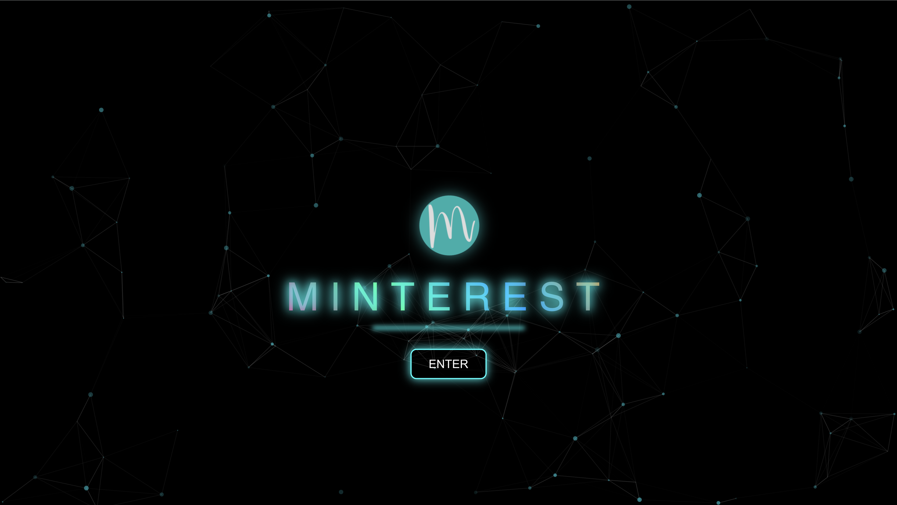
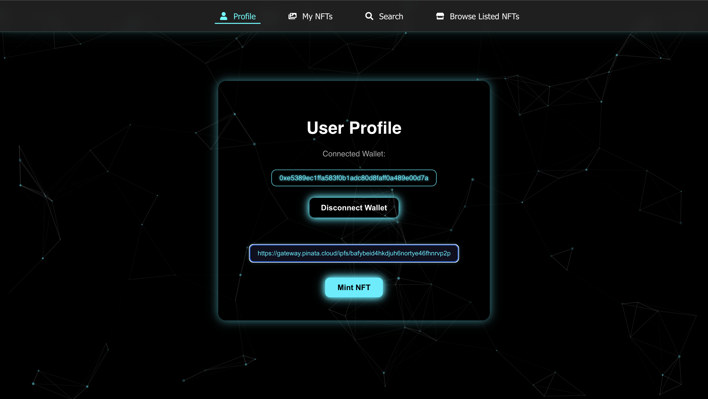
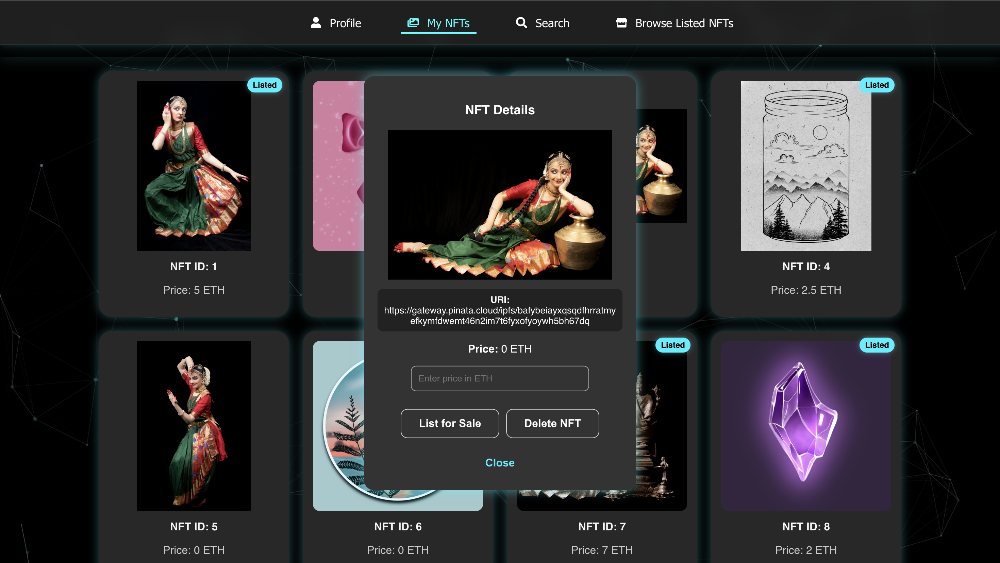
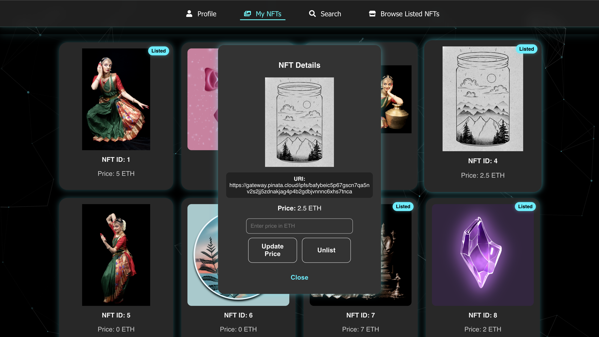
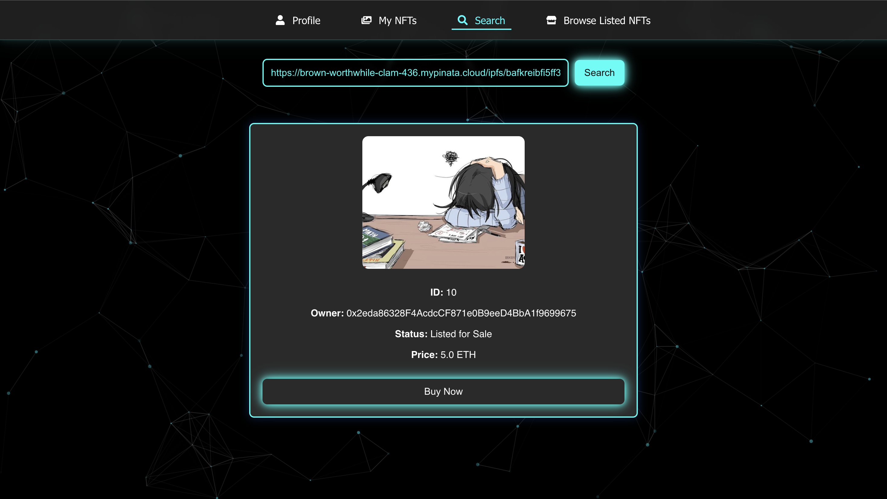
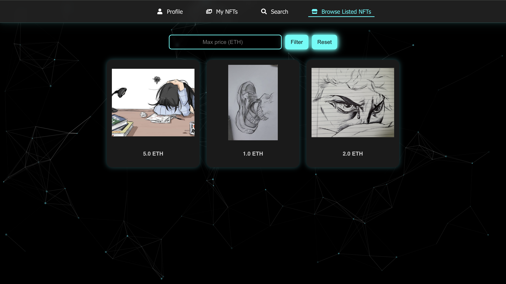
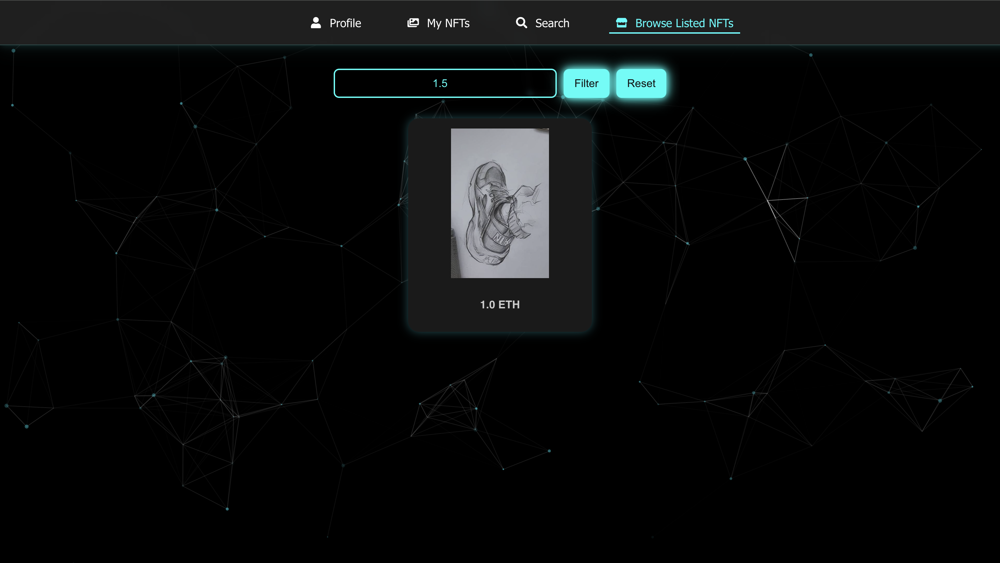
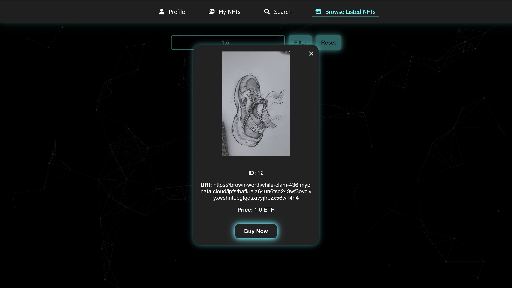

# Minterest - An NFT Marketplace

Minterest is a decentralized NFT marketplace that allows users to seamlessly manage their NFTs. Users can connect to their Metamask wallet, mint unique NFTs, list or unlist their own NFTs, browse a diverse collection of Listed NFTs from other creators, and purchase them.

----
## Table of Contents

- [Features](#features)
- [DApp Preview](#dapp-preview)
- [Technologies Used](#technologies-used)
- [Project Structure](#project-structure)
- [Running the Project](#running-the-project)
  - [Pre-requisites](#pre-requisites)
  - [Backend Setup (Truffle)](#backend-setup-truffle)
  - [Frontend Setup (React)](#frontend-setup-react)
- [NFTs Creation](#nfts-creation)

----
## Features

- Connect with MetaMask Wallet 
- Create & mint NFTs
- Delete Minted NFTs
- List NFTs for sale
- Buy NFTs from marketplace
- Unlist NFTs from sale
- Search NFT by URI
- Browse Listed NFTs and filter by price

----
## DApp Preview

**Landing Page**


**Connect Wallet and Mint NFTs**


**Owned NFTs Page**


**List owned NFT for sale / Delete owned NFT**


**Update Price of Listed NFT / Unlist NFT from sale**


**Search for an NFT with a URI**


**Browse NFTs listed for sale by others**


**Browse NFTs with Filter applied on maximum price in ETH**


**Buy a NFT after Browsing**


----
## Technologies used

### Frontend
- React.js – For building a responsive and dynamic user interface
- Ethers.js – To interact with the Ethereum blockchain and the smart contract

### Backend 
- Solidity – For writing the Smart contract 
- Truffle – For development, testing, and deployment of the blockchain
- Ganache – Local blockchain for testing the smart contract

### Others
- IPFS/Pinata (https://pinata.cloud) – For storage of NFT metadata and images

---
## Project Structure
```
.
├── README.md
├── backend
│   ├── build
│   │   └── contracts
│   │       └── NFTMarketPlace.json
│   ├── contracts
│   │   └── NFTMarketPlace.sol
│   ├── migrations
│   │   └── 2_deploy_contracts.js
│   ├── package-lock.json
│   ├── package.json
│   └── truffle-config.js
└── client
    ├── package-lock.json
    ├── package.json
    ├── .env
    ├── .gitignore
    ├── public
    │   ├── index.html
    │   ├── logo192.png
    │   ├── logo512.png
    │   ├── manifest.json
    │   ├── minterest_logo.ico
    │   ├── minterest_logo.png
    │   └── robots.txt
    └── src
        ├── App.css
        ├── App.js
        ├── NFTMarketPlace.json
        ├── global.css
        ├── index.css
        ├── index.js
        ├── logo.png
        └── pages
            ├── BrowseNFTs.js
            ├── Home.js
            ├── LandingPage.js
            ├── MyNFTs.js
            ├── Navbar.js
            ├── Profile.js
            ├── Search.js
            └── walletContext.js
```
---

## Running the Project

### Pre-requisites 
- node.js
- Truffle
- Ganache (CLI/GUI)
- MetaMask Browser Extension

### Clone the repo
```bash
git clone https://github.com/aarabhianand/minterest-blockchain.git
cd minterest-blockchain
```

### Start Ganache
Make sure Ganache is running on your system (GUI or CLI)

---

### Backend Setup (Truffle)

- Install backend dependencies
```bash
npm install
```

- Compile and deploy contracts
```bash
truffle compile
truffle migrate --network development
```

---

## Frontend Setup (React)

- Navigate to React frontend
```bash
cd client
```

- Install frontend dependencies
```bash
npm install
```

- Create a `.env` file and insert your compiled contract address
```bash
REACT_APP_CONTRACT_ADDRESS = "Your_compiled_contract_address"
```

- Start the React development server
```bash
npm start
```

The app will be available at: [http://localhost:3000](http://localhost:3000)

---

## NFTs Creation

This app uses Images uploaded to [Pinata](https://pinata.cloud) as NFTs. Any other IPFS platform can be used.
